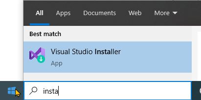
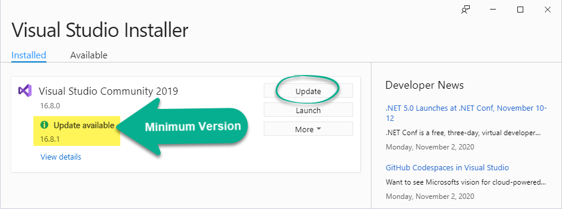

# CPSC-1517 - Lesson Plans

| Week | Monday | Tuesday | Thursday |
|:----:|--------|---------|----------|
|  1   | [W01-D1](#w01d1) | [W01-D2](#w01d2) | [W01-D3](#w01d3) |
|  2   | [W02-D1](#w02d1) | [W02-D2](#w02d2) | [W02-D3](#w02d3) |
|  3   | [W03-D1](#w03d1) | [W03-D2](#w03d2) | [W03-D3](#w03d3) |
|  4   | [W04-D1](#w04d1) | [W04-D2](#w04d2) | [W04-D3](#w04d3) |
|  5   | [W05-D1](#w05d1) | [W05-D2](#w05d2) | [W05-D3](#w05d3) |
|  6   | [W06-D1](#w06d1) | [W06-D2](#w06d2) | [W06-D3](#w06d3) |
|  7   | [W07-D1](#w07d1) | [W07-D2](#w07d2) | [W07-D3](#w07d3) |
|  8   | [W08-D1](#w08d1) | [W08-D2](#w08d2) | [W08-D3](#w08d3) |
|  9   | [W09-D1](#w09d1) | [W09-D2](#w09d2) | [W09-D3](#w09d3) |
|  10  | [W10-D1](#w10d1) | [W10-D2](#w10d2) | [W10-D3](#w10d3) |
|  11  | [W11-D1](#w12d1) | [W11-D2](#w11d2) | [W11-D3](#w11d3) |
|  12  | [W12-D1](#w12d1) | [W12-D2](#w12d2) | [W12-D3](#w12d3) |
|  13  | [W13-D1](#w13d1) | [W13-D2](#w13d2) | [W13-D3](#w13d3) |
|  14  | [W14-D1](#w14d1) | [W14-D2](#w14d2) | [W14-D3](#w14d3) |
|  15  | [W15-D1](#w15d1) | [W15-D2](#w15d2) | [W15-D3](#w15d3) |

---

## W01D1

> No Classes

---


## W01D2 

> - [ ] A03 (T/Th/F)
> - [x] A04 (M/W/F)

- [Syllabus/Intro](../Common/Syllabus.md)
  - My Intro
  - Mark Breakdown
  - Software
- new Console App - "Hello World"
- Use Source Control in VS 2019 (push to GitHub)

#### "Hello World"

Start off with a classic Hello World app in .NET 4.8 (`HelloWorld.csproj` and "**Hello to the World**" solution).

```csharp
Console.WriteLine("Hello World");
```

Expand with other concepts, such as

- Static methods
  ```csharp
  WriteLine("Hello World"); // using static System.Console;
  ```
- Where is your .exe?
- Running the .exe in PowerShell (terminal)
- What is the `string[] args` used for? (plus **string interpolation**)
  ```csharp
  if (args != null && args.Length > 0) // I have one or more strings supplied to my program
  {
      foreach (string word in args)
          WriteLine($"Hello {word}"); // String Interpolation - $"{expression}"
  }
  else
  {
      WriteLine("Hello World");
  }
  ```
- Help Text with [**verbatim string literals**](https://docs.microsoft.com/en-us/dotnet/csharp/programming-guide/strings/#regular-and-verbatim-string-literals)
  ```csharp
  // Display some "Help" information
  WriteLine(@"Hello World
  ===== =====
  
  Usage: .\HelloWorld [names]
  
  where
       [names] is a space-separated list of names");
  ```
- Add some ***bling***
  ```csharp
  // Display some "Help" information
  ForegroundColor = ConsoleColor.Green; // Change the foreground color of the Console
  ```


---

## W01D3

> - [ ] A03 (T/Th/F)
> - [ ] A04 (M/W/F)

- Accept **Workbook** assignment
- Learn/Practice writing **Markdown**
- Run **Installer**
  - Individual Components: (see Workbook)

  | Launch | Min Version *16.8.3* |
  |--------|-------------|
  | |   |

- Demo a .NET 5 (Core) version of "Hello World"
- Begin OOP Review
- [Assignment](#homework-w02d1) 

### **Homework-W02D1**

**Run the code demos** in the OOP Review and **read the source code**.

---


---

## W02D1

> - [ ] A03 (T/Th/F)
> - [ ] A04 (M/W/F)

---

## W02D2

> - [ ] A03 (T/Th/F)
> - [ ] A04 (M/W/F)

---

## W02D3

> - [ ] A03 (T/Th/F)
> - [ ] A04 (M/W/F)

---
---

## W03D1

> - [ ] A03 (T/Th/F)
> - [ ] A04 (M/W/F)

---

## W03D2

> - [ ] A03 (T/Th/F)
> - [ ] A04 (M/W/F)

---

## W03D3

> - [ ] A03 (T/Th/F)
> - [ ] A04 (M/W/F)

---
---

## W04D1

> - [ ] A03 (T/Th/F)
> - [ ] A04 (M/W/F)

---

## W04D2

> - [ ] A03 (T/Th/F)
> - [ ] A04 (M/W/F)

---

## W04D3

> - [ ] A03 (T/Th/F)
> - [ ] A04 (M/W/F)

---
---

## W05D1

> - [ ] A03 (T/Th/F)
> - [ ] A04 (M/W/F)

---

## W05D2

> - [ ] A03 (T/Th/F)
> - [ ] A04 (M/W/F)

---

## W05D3

> - [ ] A03 (T/Th/F)
> - [ ] A04 (M/W/F)

---
---

## W06D1

> - [ ] A03 (T/Th/F)
> - [ ] A04 (M/W/F)

---

## W06D2

> - [ ] A03 (T/Th/F)
> - [ ] A04 (M/W/F)

---

## W06D3

> - [ ] A03 (T/Th/F)
> - [ ] A04 (M/W/F)

---
---

## W07D1

> - [ ] A03 (T/Th/F)
> - [ ] A04 (M/W/F)

---

## W07D2

> - [ ] A03 (T/Th/F)
> - [ ] A04 (M/W/F)

---

## W07D3

> - [ ] A03 (T/Th/F)
> - [ ] A04 (M/W/F)

---
---

## W08D1

> - [ ] A03 (T/Th/F)
> - [ ] A04 (M/W/F)

---

## W08D2

> - [ ] A03 (T/Th/F)
> - [ ] A04 (M/W/F)

---

## W08D3

> - [ ] A03 (T/Th/F)
> - [ ] A04 (M/W/F)

---
---

## W09D1

> - [ ] A03 (T/Th/F)
> - [ ] A04 (M/W/F)

---

## W09D2

> - [ ] A03 (T/Th/F)
> - [ ] A04 (M/W/F)

---

## W09D3

> - [ ] A03 (T/Th/F)
> - [ ] A04 (M/W/F)

---
---

## W10D1

> - [ ] A03 (T/Th/F)
> - [ ] A04 (M/W/F)

---

## W10D2

> - [ ] A03 (T/Th/F)
> - [ ] A04 (M/W/F)

---

## W10D3

> - [ ] A03 (T/Th/F)
> - [ ] A04 (M/W/F)

---
---

## W11D1

> - [ ] A03 (T/Th/F)
> - [ ] A04 (M/W/F)

---

## W11D2

> - [ ] A03 (T/Th/F)
> - [ ] A04 (M/W/F)

---

## W11D3

> - [ ] A03 (T/Th/F)
> - [ ] A04 (M/W/F)

---
---

## W12D1

> - [ ] A03 (T/Th/F)
> - [ ] A04 (M/W/F)

---

## W12D2

> - [ ] A03 (T/Th/F)
> - [ ] A04 (M/W/F)

---

## W12D3

> - [ ] A03 (T/Th/F)
> - [ ] A04 (M/W/F)

---
---

## W13D1

> - [ ] A03 (T/Th/F)
> - [ ] A04 (M/W/F)

---

## W13D2

> - [ ] A03 (T/Th/F)
> - [ ] A04 (M/W/F)

---

## W13D3

> - [ ] A03 (T/Th/F)
> - [ ] A04 (M/W/F)

---
---

## W14D1

> - [ ] A03 (T/Th/F)
> - [ ] A04 (M/W/F)

---

## W14D2

> - [ ] A03 (T/Th/F)
> - [ ] A04 (M/W/F)

---

## W14D3

> - [ ] A03 (T/Th/F)
> - [ ] A04 (M/W/F)

---
---

## W15D1

> - [ ] A03 (T/Th/F)
> - [ ] A04 (M/W/F)

---

## W15D2

> - [ ] A03 (T/Th/F)
> - [ ] A04 (M/W/F)

---

## W15D3

> - [ ] A03 (T/Th/F)
> - [ ] A04 (M/W/F)

