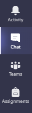

# Our First Class

Hello, and Welcome!!

My name is ***Dan Gilleland*** and I will be your instructor for this course. All our lecture times will be done through remote classrooms using [**Microsoft Teams**](https://teams.microsoft.com) ([https://teams.microsoft.com](https://teams.microsoft.com)). You should receive an email about our first class with the **_TIME_** and **_DATE_** as well as a link to **_RSVP_**.

First, download and install Microsoft Teams. You can [**install it on your desktop**](https://youtu.be/qx8xHpRMFHU) and [on your phone](https://youtu.be/gvCRIieb7NQ). I'm assuming you have a computer with Windows 10 installed, so just use the instructions in the following video (if not, please contact me by email - dgilleland@nait.ca).

Install MS Teams - https://youtu.be/qx8xHpRMFHU

Once you have Microsoft Teams installed, use the **Chat** feature as the primary way to contact me. For more information, check out this video on [*Communicating with Microsoft Teams as a Student*](https://youtu.be/PasT3Q1ZR_I).

Here's the general **agenda for our first class**.

- Introductions
- Course Overview
- About Learning Online (etiquette and safety, flipped classes, lectures, etc.)
- Software Requirements
- Online Resources (MS Teams, Moodle, etc.)
- Help outside regular class times

I'm looking forward to meeting you and starting with you on your journey through this course!

***Dan** Gilleland*
