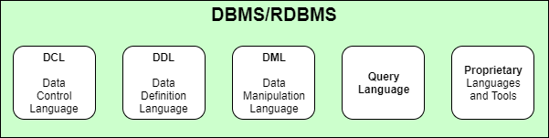
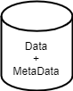
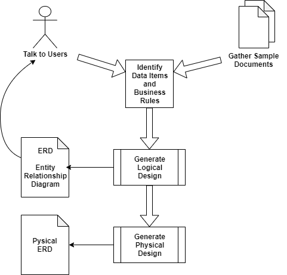
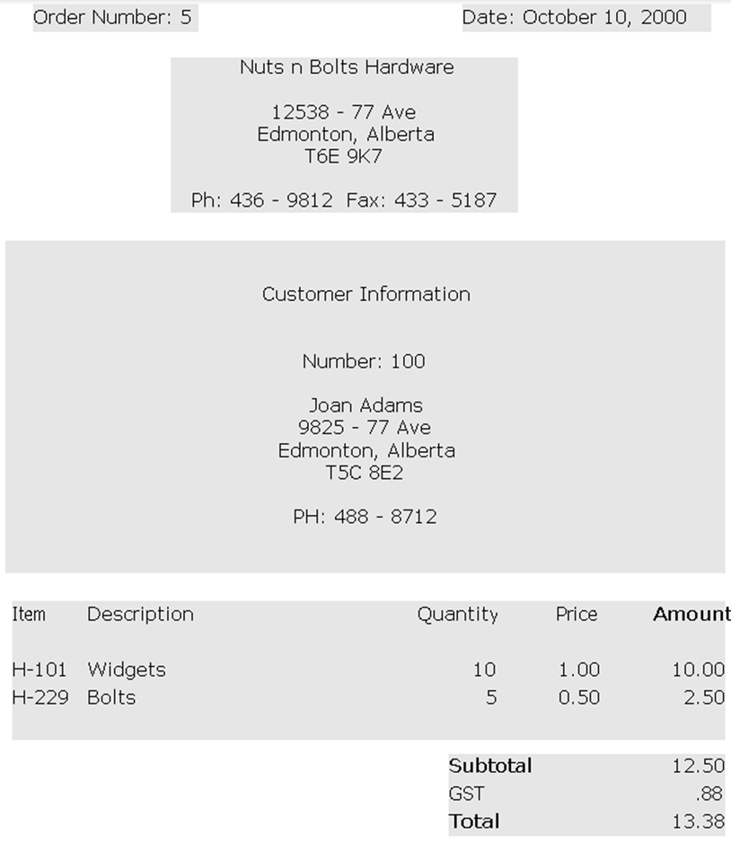
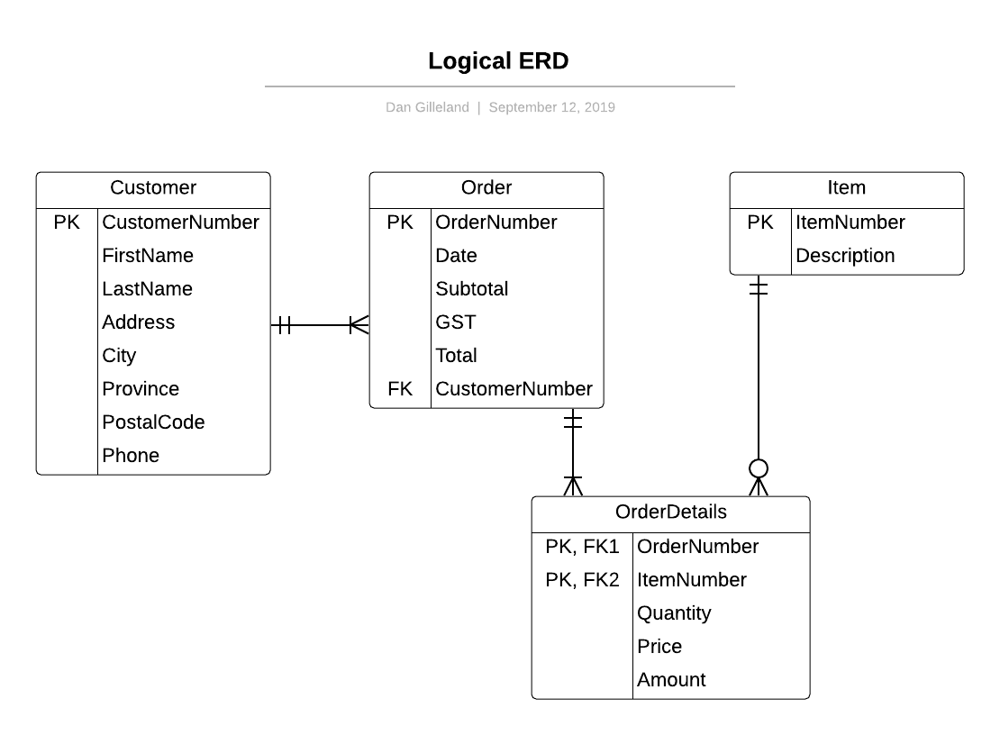

# Intro to Databases

---

## Primary Components of a DBMS

## Primary Components of a Database

---

# How are Databases Used?

- ### **R**etrieve Data
- ### **E**dit Data
- ### **A**dd Data
- ### **D**elete Data

(aka: *CRUD*)

---

# Benefits of using Databases

---

# The Design Process

---

# Source Documents

---

# ERDs

---

# ERDs - The Entity

---

# ERDs - The Relationships
